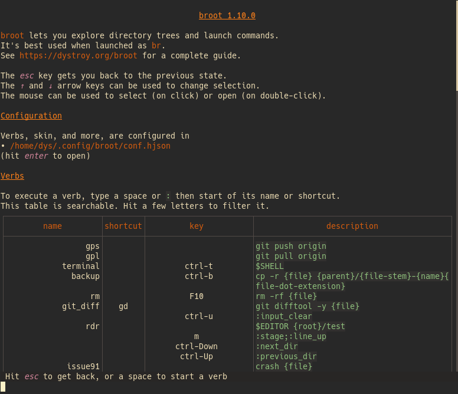
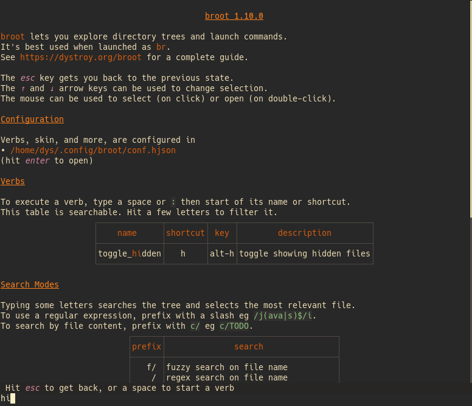

Broot's help screen is designed to be as short as possible while giving the essential references and directions.

It starts with the version (useful to get help), links to the documentation (you may ctrl-click the link on most terminals) then explains how to edit the configuration, lists the commands and shortcuts, the search modes, and ends with the list of special feature the executable you're using was compiled with (once again, this is handy when you need help).

# Open the help

As for everything, this can be configured, but you'll normally get to the help either

* by hitting the <kbd>?</kbd> key
* by typing `:help` then <kbd>enter</kbd>

And you'll leave this screen with a hit on the <kbd>esc</kbd> key.

# edit the configuration

When in this screen, the current selection is the configuration file.

What it means is that any verb taking as argument a file can be executed.

For example, hitting <kbd>enter</kbd> calls the standard opening of this file.

And if you configured a text editor, let's say bound on `:e`, it would work too.

This is the fastest way to change the configuration.

# Verbs

*Verbs* are what is combined with the selection and optional arguments to make the commands you execute.
They're behind every action in Broot, so their list, made from both the built-in verbs and the ones you configured, is essential.

But this list is a little to long for scanning, so you'll most often search it.

For example, let's imagine you want to see what's the shortcut for showing *hidden* files.
You search for the first letter of your topic, here "hi". The list is filtered while you type to reveal the interesting verb(s):

In this example you see that you can toggle showing hidden files by hitting <kbd>alt</kbd><kbd>h</kbd> or by typing `:h` then <kbd>enter</kbd>.

# Check search modes and their prefixes

There are [several kinds of searches](../input).

You might want to check those modes and their prefixes (which can be [configured](../conf_file/#search-modes)):

