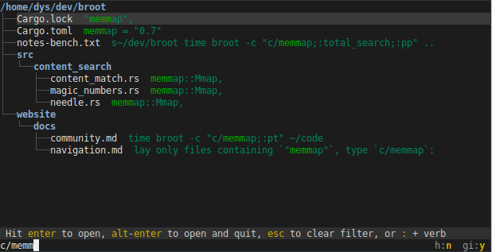
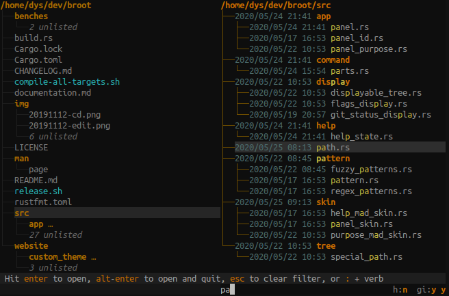

**[Installation](install)**

# Get an overview of a directory, even a big one

Notice the *unlisted*?

That's what makes it usable where the old `tree` command would produce pages of output.

`.gitignore` files are properly dealt with to put unwanted files out of your way (you can ignore them though, see [documentation](../navigation/#toggles)).

# Find a directory then `cd` to it

This way, you can navigate to a directory with the minimum amount of keystrokes, even if you don't exactly remember where it is.

broot is fast and never blocks, even when you make it search a big slow disk (any keystroke interrupts the current search to start the next one).

Most useful keys for this:

* the letters of what you're looking for
* <kbd>enter</kbd> to select a directory (staying in broot)
* <kbd>esc</kbd> to get back to the previous state or clear your search
* <kbd>alt</kbd><kbd>enter</kbd> to get back to the shell having `cd` to the selected directory
* `:q` if you just want to quit (you can use <kbd>ctrl</kbd><kbd>q</kbd> if you prefer)

# Never lose track of file hierarchy while you search

broot tries to select the most relevant file. You can still go from one match to another one using <kbd>tab</kbd> or arrow keys.

You may also search with a regular expression. To do this, add a `/` before the pattern.

And you have other types of searches, for example searching on file content (start with `c/`):

You may also apply logical operators or combine patterns, for example searching `test` in all files except json ones could be `!/json$/&c/test` and searching `carg` both in file names and file contents would be `carg|c/carg`.

Once the file you want is selected you can

* hit <kbd>enter</kbd> (or double-click) to open it in your system's default program
* hit <kbd>alt</kbd><kbd>enter</kbd> to open it in your system's default program and close broot
* type a verb. For example `:e` opens the file in your preferred editor (which may be a terminal one)

# Manipulate your files

Most often you move your files in the blind. You do a few `ls` before, then your manipulation, and maybe you check after.

You can instead do it without losing the view of the file hierarchy.

Move, copy, rm, mkdir, are built in and you can add your own shortcuts.

# Do it with panels

Do <kbd>ctrl</kbd><kbd>→</kbd> and you open another panel (you may open other ones, or navigate between them, with <kbd>ctrl</kbd><kbd>←</kbd> and <kbd>ctrl</kbd><kbd>→</kbd>).

(yes, colors are fully customizable)

Using two panels, you can for example copy or move elements between them:

If you like you may do it Norton Commander style by binding `:copy_to_panel` to <kbd>F5</kbd> and `:move_to_panel` to <kbd>F6</kbd>.

# Apply a standard or personal shortcut to a file

Just find the file you want to edit with a few keystrokes, type `:e`, then <kbd>enter</kbd>.

You can add verbs or configure the existing ones; see [documentation](../conf_file/#verbs-shortcuts-and-keys).

And you can add shorcuts, for example a <kbd>ctrl</kbd> sequence or a function key

# Replace `ls` (and its clones):

If you want to display *dates* and *permissions*, do `br -dp` which gets you this:

You may also toggle options with a few keystrokes while inside broot. For example hitting a space, a `d` then enter shows you the dates. Or a space, then `h` then enter and you see hidden files.

# Sort, see what takes space:

You may sort by launching broot with `--sort-by-size` or `--sort-by-date`. Or you may, inside broot, just type a space, then `sd`, and <kbd>enter</kbd> and you toggled the `:sort_by_date` mode.

When sorting, the whole content of directories is taken into account. So if you want to find on monday morning the most recently modified files, just launch `br --sort-by-date ~`.

If you start broot with the `--whale-spotting` option (or its shorcut `-w`), you get a mode tailored to "whale spotting" navigation, making it easy to determine what files or folders take space.

And you keep all broot tools, like filtering or the ability to delete or open files and directories.

Sizes, dates, files counts, are computed in the background, you don't have to wait for them when you navigate.

# check git statuses:

Use `:gf` to display the statuses of files (what are the new ones, the modified ones, etc.), the current branch name and the change statistics.

And if you want to see *only* the files which would be displayed by the `git status` command, do `:gs`.

# More...

See [how to install](install), [configure](conf_file), or [use](launch).

