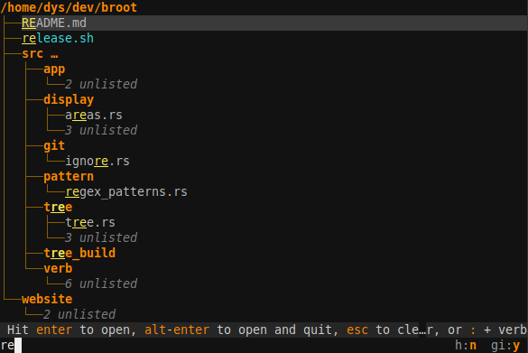
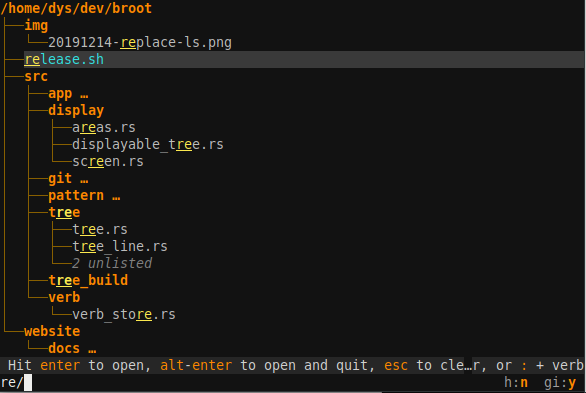
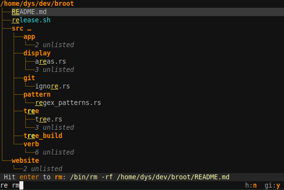

## General form

The input is the area at the bottom of the focused panel, in which you can type a filter or a command.

Its parts are

* a filtering pattern
* a command, starting with a space or a colon (`:`)

Both parts are optional.

Filtering patterns are detailled in the [Navigation](navigation.md) chapter.

Commands are detailled in the [Verbs & Commands](verbs.md) chapter.

## Examples

### A Fuzzy search:

`re`

### A regular expression based search:

`re/` (which is equivalent to `/re/` or `/re`)

### A search followed by a command without arguments:

`re rm` (which is equivalent to `re:rm`)

This is very natural: You use the search to select your element and you don't need to remove it before typing the command.

### A search followed by a command taking an argument:

`re mv ../regex.rs`

## Tab completion

When you type a verb, a few letters are often enough because broot just want enough of them to be sure there's no confusion.
But sometimes there are a lot of verbs with the same start (especially if you add them liberally in the config file). You might want to have broot complete or propose the few possible completions. The <kbd>tab</kbd> key can be used for this purpose.

Tab completion is probably more useful even with paths you provide to verbs. It works intuitively.

Note: there's another solution to gain time when typing a path, especially when you're not sure of it: hitting <kbd>ctrl</kbd><kbd>p</kbd> will open a new panel in which you can navigate until you have your selection that you validate with another hit on <kbd>ctrl</kbd><kbd>p</kbd> (see [panels](panels.md)).
