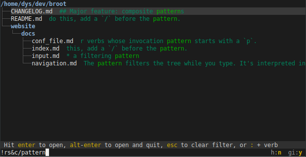

# Basics

When you start broot, the current directory is displayed, with most often some directories open and some lines truncated, in order to fit the available height.

The first line is called the root, and is currently selected.

From here you may navigate using the following keys:

* <kbd class=b>↓</kbd> or <kbd class=b>↑</kbd> : select the next or previous line
* <kbd>ctrl</kbd><kbd class=b>←</kbd> or <kbd>ctrl</kbd><kbd class=b>→</kbd> : focus (or open) a panel to the left or to the right
* <kbd class=b>⏎</kbd> on a file : open the file using xdg-open (or your OS equivalent)
* <kbd>alt</kbd><kbd class=b>⏎</kbd> on a file : leave broot and open the file using xdg-open
* <kbd class=b>⏎</kbd> on a directory : focus the directory (i.e. make it the new root)
* <kbd>alt</kbd><kbd class=b>⏎</kbd> on a directory : leave broot and `cd` the shell to that directory.
* <kbd class=b>⏎</kbd> on the first line : goes up one level (focus the parent directory)
* <kbd>esc</kbd> gets you back to the previous state (or leave broot if there's none)
* <kbd>?</kbd> brings you to the help screen

There are also a few more shortcuts:

* you can quit with <kbd>Ctrl</kbd><kbd>q</kbd>
* you can select a line with a mouse click
* you can open a line with a mouse double-click

and you can define your own [shortcuts](../conf_verbs/#shortcuts-and-verb-search) or triggering [keyboard keys](../conf_verbs/#keyboard-key).

# Fuzzy Patterns

The best way to navigate is by filtering the tree.

This is done by typing a few letters.

The pattern filters the tree while you type. It's interpreted in a fuzzy way so that you don't have to type all the letters or even consecutive letters. The best match is automatically selected.

For example:

Hitting <kbd>esc</kbd> clears the current pattern.

# Regular Expressions

If there's a `/` before or after the pattern, it's interpreted as a regular expression.

For example `/pat+ern` would match `"patern.zip"` or `"some_patttern.rar"` but not `"pATTern"`.

If you want the regex to be case insensitive, add the `i` flag: `/pat+ern/i`.

# File content searches

To display only files containing `"memmap"`, type `c/memmap`:

(as the search is displayed in real time you'll usually stop as soon as you have the right matches)

# Composite patterns

Simple patterns can be composed with the `!`, `&` and `|` operators.

Examples:

If you don't want to see files whose name ends in `"rs"`, you may type `!/rs$` (it's the negation of the `/rs$` regular expression).

If you want to see all files containing `"pattern"` but not the rust ones, you'll type `!rs&c/pattern`:

If you're looking for a file whose name you don't remember exactly ("rust_test" ? "test-rust" ?), you may type `test&rust` meaning the name contains both "test" and "rust".

# More about searches

If you want to know more about the exact pattern syntax, see [reference](../input/#the-filtering-pattern).

# Total Search

When you search in broot in a very big directory on a slow disk, broot doesn't always look at all files. It stops when it found enough matches and then rates those matches.

If you think there might be a better match, hidden deeper, you may require a *total search*, which is a search which look at *all* files. This is done using the `:total_search` verb, which may be triggered with the <kbd>Ctrl</kbd>-<kbd>S</kbd> key combination (you may redefine it, see [configuration](../conf_file/#keyboard-key)).

As for other searches, it's interrupted as soon as you type anything.

# Quitting broot

Other than executing a command leaving broot, there are several ways to quit:

* if the current root is selected, just hit `enter`
* hit <kbd>ctrl</kbd>+<kbd>Q</kbd>
* type `:q` or `space` `q` then `enter`

