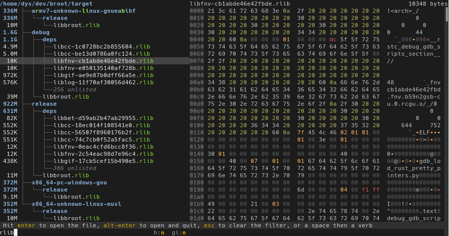
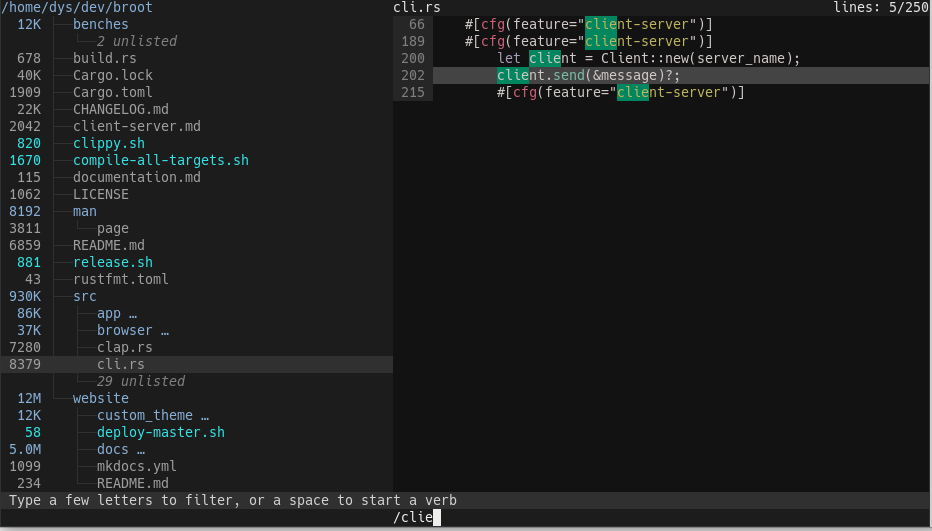
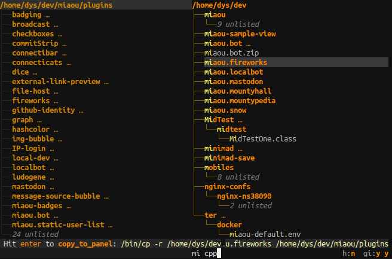
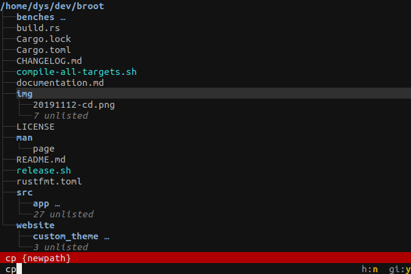
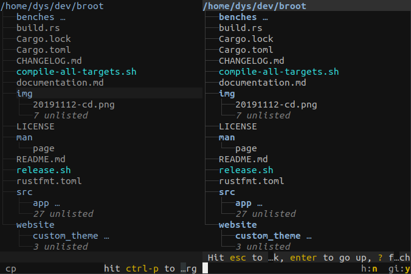
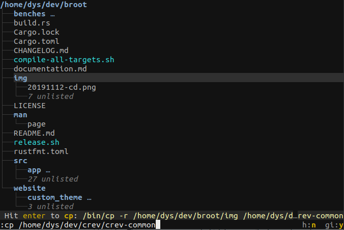
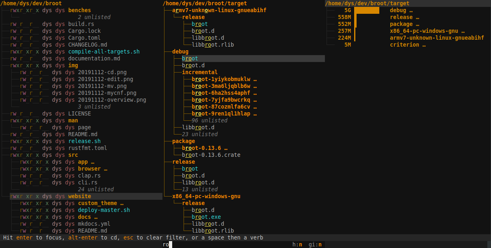

# Open panels, switch between them

To focus a panel when several are displayed, you may click on the desired one, or use the `:panel_left` and `:panel_right` verbs which are, in standard, bound to <kbd>ctrl</kbd><kbd>←</kbd> and <kbd>ctrl</kbd><kbd>→</kbd>.

When there's no panel in that direction, a new one is created:

* if the current selection is a regular file and you've hit <kbd>ctrl</kbd><kbd>→</kbd>, you get the preview panel
* in other cases you get a new tree whose root is the selected line.

This makes those shortcuts the easiest way to create a panel.

Another way is to add a bang (`!`) to a verb. It tells broot to show the result in a new panel.

For example, while `:focus ~` navigates to your home directory in the current panel, you can use `:!focus ~` or `:focus! ~` to open a new panel on your home.

The `:close_panel` closes the current panel and is bound to <kbd>ctrl</kbd><kbd>W</kbd> (remember: you can [change all bindings](../conf_verbs/#keyboard-key)).

# The preview panel


It's not immediately focused on creation, because most often you'll want to preview a few files and it's convenient to stay in the tree to navigate.
To focus it, for example to scroll it, do <kbd>ctrl</kbd><kbd>→</kbd> again.

Files that can't be interpreted as text or image are shown as binary:



You can search with fuzzy patterns or regular expressions inside a text preview panel:



You can go from the selected matched line to the unfiltered text, at the right place, with <kbd>ctrl</kbd><kbd>→</kbd> (and then back to the list of matching lines with <kbd>ctrl</kbd><kbd>←</kbd>).

Hopefully [this blog post](https://dystroy.org/blog/broot-c-search/) should make the complete search workflow look natural.


# Copy, move between panels... or more

When exactly two panels are displayed, `{other-panel-file}` `{other-panel-directory}`, and `{other-panel-parent}` are available for verbs.

Two built-in verbs use those arguments: `:copy_to_panel` (alias `:cpp`) and `:move_to_panel` (alias `:mvp`). By having two panels displayed you can thus copy (or move) the current panel's selection to the other one:



The default configuration file contains this that you may uncomment to add <kbd>F5</kbd> and <kbd>F6</kbd> shortcuts:


```toml
# [[verbs]]
# key = "F5"
# execution = ":copy_to_panel"
#
# [[verbs]]
# key = "F6"
# execution = ":move_to_panel"
```

You may define other shortcuts, or your own bi-panels verbs.

# Use a panel to edit a verb argument

Assuming you started from just one panel and wanted to execute a command taking a path as argument. You may use tab-completion to type it faster but you may also hit <kbd>ctrl</kbd><kbd>P</kbd> to create a panel and select it. Here's the complete workflow.

* Start with selecting a file and typing the verb of your choice:


* hit ctrl-p. This opens a new panel which becomes the focused panel:


* navigate to the desired destination using standard broot features:


* hit ctrl-p again, which closes the panel and updates the input in the first panel:


You may now hit enter to execute the command, maybe after having completed the path.

This workflow is based on the `:start_end_panel` verb which can be bound to another key if desired.

# More about panels

If your terminal is wide enough, you may open more panels:




