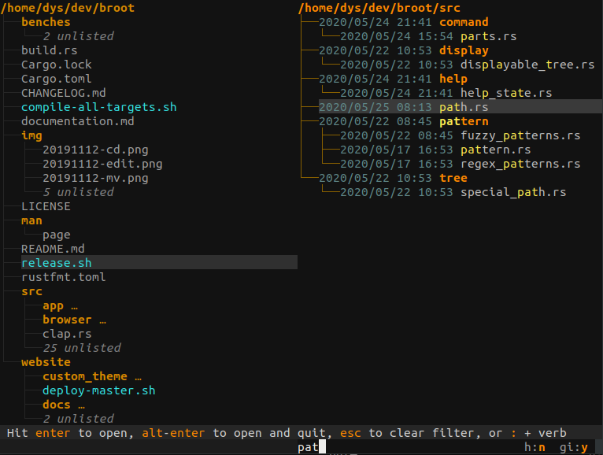
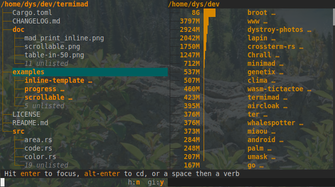
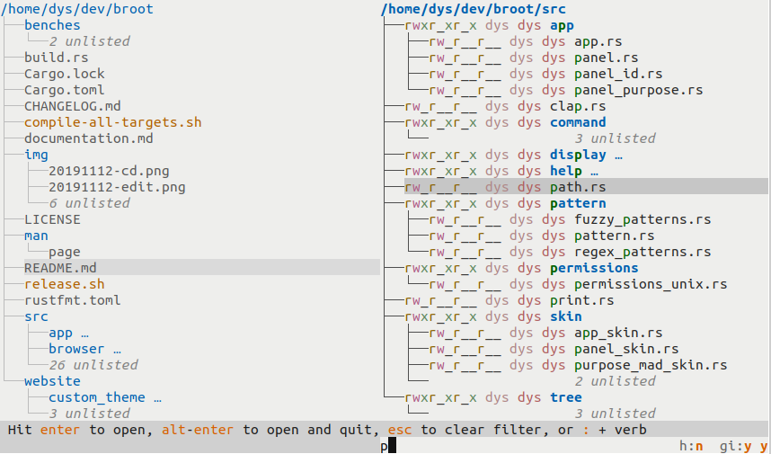
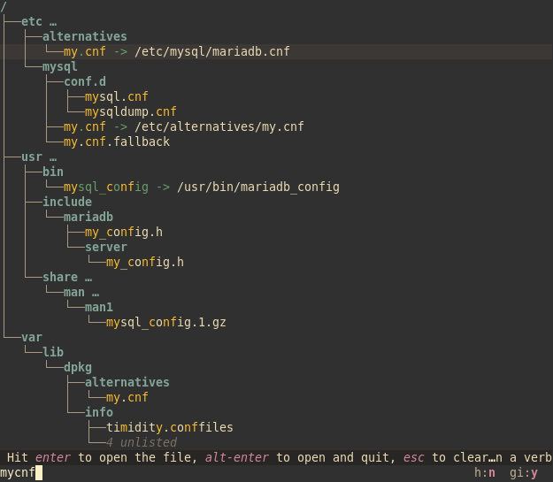
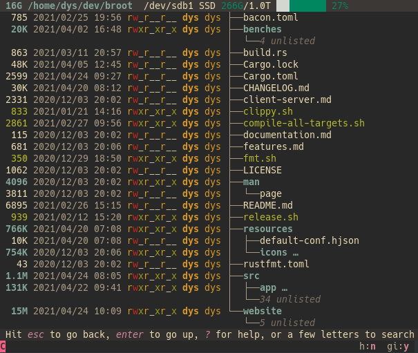

# Skin configuration

You can change all colors by adding a `[skin]` section in your `conf.toml` file.

To start with, you might want broot to use more of your terminal colors.

## Use terminal's default foreground and background

Try adding this in your [config file](../conf_file):

```Hjson
skin: {
	default: "none none"
	...
```
```toml
[skin]
default = "none none"
...
```

The first `none` sets the terminal default foreground color as broot's default one, and the second one is for the background.

Depending on your default colors, the result might be good or not.

From there, keeping or not the default colors, you may define a whole skin.

## A whole skin

For example:

```Hjson
skin: {
	default: gray(23) none / gray(20) none
	tree: ansi(94) None / gray(3) None
	file: gray(20) None / gray(15) None
	directory: ansi(208) None Bold / ansi(172) None bold
	exe: Cyan None
	link: Magenta None
	pruning: gray(12) None Italic
	perm__: gray(5) None
	perm_r: ansi(94) None
	perm_w: ansi(132) None
	perm_x: ansi(65) None
	owner: ansi(138) None
	group: ansi(131) None
	count: ansi(136) gray(3)
	dates: ansi(66) None
	sparse: ansi(214) None
	content_extract: ansi(29) None
	content_match: ansi(34) None
	git_branch: ansi(229) None
	git_insertions: ansi(28) None
	git_deletions: ansi(160) None
	git_status_current: gray(5) None
	git_status_modified: ansi(28) None
	git_status_new: ansi(94) None Bold
	git_status_ignored: gray(17) None
	git_status_conflicted: ansi(88) None
	git_status_other: ansi(88) None
	selected_line: None gray(5) / None gray(4)
	char_match: Yellow None
	file_error: Red None
	flag_label: gray(15) None
	flag_value: ansi(208) None Bold
	input: White None / gray(15) gray(2)
	status_error: gray(22) ansi(124)
	status_job: ansi(220) gray(5)
	status_normal: gray(20) gray(3) / gray(2) gray(2)
	status_italic: ansi(208) gray(3) / gray(2) gray(2)
	status_bold: ansi(208) gray(3) Bold / gray(2) gray(2)
	status_code: ansi(229) gray(3) / gray(2) gray(2)
	status_ellipsis: gray(19) gray(1) / gray(2) gray(2)
	purpose_normal: gray(20) gray(2)
	purpose_italic: ansi(178) gray(2)
	purpose_bold: ansi(178) gray(2) Bold
	purpose_ellipsis: gray(20) gray(2)
	scrollbar_track: gray(7) None / gray(4) None
	scrollbar_thumb: gray(22) None / gray(14) None
	help_paragraph: gray(20) None
	help_bold: ansi(208) None Bold
	help_italic: ansi(166) None
	help_code: gray(21) gray(3)
	help_headers: ansi(208) None
	help_table_border: ansi(239) None
	preview_title: gray(23) None / gray(21) None
	preview: gray(20) gray(1) / gray(18) gray(2)
	preview_line_number: gray(12) gray(3)
	preview_match: None ansi(29)
	hex_null: gray(11) None
	hex_ascii_graphic: gray(18) None
	hex_ascii_whitespace: ansi(143) None
	hex_ascii_other: ansi(215) None
	hex_non_ascii: ansi(167) None
	staging_area_title: gray(22) None / gray(20) None
	mode_command_mark: gray(5) ansi(204) Bold
}
```
```toml
[skin]
default = "gray(23) none / gray(20) none"
tree = "ansi(94) None / gray(3) None"
file = "gray(20) None / gray(15) None"
directory = "ansi(208) None Bold / ansi(172) None bold"
exe = "Cyan None"
link = "Magenta None"
pruning = "gray(12) None Italic"
perm__ = "gray(5) None"
perm_r = "ansi(94) None"
perm_w = "ansi(132) None"
perm_x = "ansi(65) None"
owner = "ansi(138) None"
group = "ansi(131) None"
count = "ansi(136) gray(3)"
dates = "ansi(66) None"
sparse = "ansi(214) None"
content_extract = "ansi(29) None"
content_match = "ansi(34) None"
git_branch = "ansi(229) None"
git_insertions = "ansi(28) None"
git_deletions = "ansi(160) None"
git_status_current = "gray(5) None"
git_status_modified = "ansi(28) None"
git_status_new = "ansi(94) None Bold"
git_status_ignored = "gray(17) None"
git_status_conflicted = "ansi(88) None"
git_status_other = "ansi(88) None"
selected_line = "None gray(5) / None gray(4)"
char_match = "Yellow None"
file_error = "Red None"
flag_label = "gray(15) None"
flag_value = "ansi(208) None Bold"
input = "White None / gray(15) gray(2)"
status_error = "gray(22) ansi(124)"
status_job = "ansi(220) gray(5)"
status_normal = "gray(20) gray(3) / gray(2) gray(2)"
status_italic = "ansi(208) gray(3) / gray(2) gray(2)"
status_bold = "ansi(208) gray(3) Bold / gray(2) gray(2)"
status_code = "ansi(229) gray(3) / gray(2) gray(2)"
status_ellipsis = "gray(19) gray(1) / gray(2) gray(2)"
purpose_normal = "gray(20) gray(2)"
purpose_italic = "ansi(178) gray(2)"
purpose_bold = "ansi(178) gray(2) Bold"
purpose_ellipsis = "gray(20) gray(2)"
scrollbar_track = "gray(7) None / gray(4) None"
scrollbar_thumb = "gray(22) None / gray(14) None"
help_paragraph = "gray(20) None"
help_bold = "ansi(208) None Bold"
help_italic = "ansi(166) None"
help_code = "gray(21) gray(3)"
help_headers = "ansi(208) None"
help_table_border = "ansi(239) None"
preview_title = "gray(23) None / gray(21) None"
preview = "gray(20) gray(1) / gray(18) gray(2)"
preview_line_number = "gray(12) gray(3)"
preview_match = "None ansi(29)"
hex_null = "gray(11) None"
hex_ascii_graphic = "gray(18) None"
hex_ascii_whitespace = "ansi(143) None"
hex_ascii_other = "ansi(215) None"
hex_non_ascii = "ansi(167) None"
staging_area_title = "gray(22) None / gray(20) None"
mode_command_mark = "gray(5) ansi(204) Bold"
```

This would look like this:



Each skin entry value is made of

* a foreground color
* a background color (or `none`)
* zero, one, or more *attributes*

These tree parts can be repeated, after a `/`, to define the style to use in non focused panels (when more than one panel is used).

Example:

```hjson
directory: "ansi(208) None Bold / ansi(172) None"
```
```toml
directory = "ansi(208) None Bold / ansi(172) None"
```

A color can be

* `none`
* an [Ansi value](https://en.wikipedia.org/wiki/ANSI_escape_code), for example `ansi(160)`
* a grayscale value, with a level between 0 and 23, for example `grey(3)`
* a RGB color, for example `rgb(255, 187, 0)`

Beware that many terminals aren't compatible with RGB 24 bits colors (or aren't usually configured for).

Currently supported attributes are:

* bold
* crossedout
* italic
* overlined
* reverse
* underlined

Note that some of them may be ignored by your terminal especially if you're not on a Unix system.

The mapping between keys and screen parts may not always be obvious. Don't hesitate to come ask for help on [Miaou](https://miaou.dystroy.org/3490?broot).

## Transparent background

If you want to set the background of broot transparent (i.e. to be the background of your terminal), you can set the default style like this:

```hjson
default: "gray(23) none / gray(20) none"
```
```toml
default = "gray(23) none / gray(20) none"
```



# White Background Skin

This skin has a transparent main background and dark foreground colors.

It is suitable if your terminal has a clear background.

```Hjson
skin: {
	default: gray(1) None
	tree: gray(7) None / gray(18) None
	parent: gray(5) None / gray(10) None
	file: gray(3) None / gray(8) None
	directory: ansi(25) None Bold / ansi(25) None
	exe: ansi(130) None
	link: Magenta None
	pruning: gray(12) None Italic
	perm__: gray(5) None
	perm_r: ansi(94) None
	perm_w: ansi(132) None
	perm_x: ansi(65) None
	owner: ansi(138) None
	group: ansi(131) None
	dates: ansi(66) None
	sparse: ansi(214) None
	git_branch: ansi(229) None
	git_insertions: ansi(28) None
	git_deletions: ansi(160) None
	git_status_current: gray(5) None
	git_status_modified: ansi(28) None
	git_status_new: ansi(94) None Bold
	git_status_ignored: gray(17) None
	git_status_conflicted: ansi(88) None
	git_status_other: ansi(88) None
	selected_line: None gray(19) / None gray(21)
	char_match: ansi(22) None
	file_error: Red None
	flag_label: gray(9) None
	flag_value: ansi(166) None Bold
	input: gray(1) None / gray(4) gray(20)
	status_error: gray(22) ansi(124)
	status_normal: gray(2) gray(20)
	status_job: ansi(220) gray(5)
	status_italic: ansi(166) gray(20)
	status_bold: ansi(166) gray(20)
	status_code: ansi(17) gray(20)
	status_ellipsis: gray(19) gray(15)
	purpose_normal: gray(20) gray(2)
	purpose_italic: ansi(178) gray(2)
	purpose_bold: ansi(178) gray(2) Bold
	purpose_ellipsis: gray(20) gray(2)
	scrollbar_track: gray(20) none
	scrollbar_thumb: ansi(238) none
	help_paragraph: gray(2) none
	help_bold: ansi(202) none bold
	help_italic: ansi(202) none italic
	help_code: gray(5) gray(22)
	help_headers: ansi(202) none
	help_table_border: ansi(239) None
	preview_title: gray(3) None / gray(5) None
	preview: gray(5) gray(23) / gray(7) gray(23)
	preview_line_number: gray(6) gray(20)
	preview_match: None ansi(29) Underlined
	hex_null: gray(15) None
	hex_ascii_graphic: gray(2) None
	hex_ascii_whitespace: ansi(143) None
	hex_ascii_other: ansi(215) None
	hex_non_ascii: ansi(167) None
	staging_area_title: gray(8) None / gray(13) None
	mode_command_mark: gray(15) ansi(204) Bold
}
```
```toml
[skin]
default = "gray(1) None"
tree = "gray(7) None / gray(18) None"
file = "gray(3) None / gray(8) None"
directory = "ansi(25) None Bold / ansi(25) None"
exe = "ansi(130) None"
link = "Magenta None"
pruning = "gray(12) None Italic"
perm__ = "gray(5) None"
perm_r = "ansi(94) None"
perm_w = "ansi(132) None"
perm_x = "ansi(65) None"
owner = "ansi(138) None"
group = "ansi(131) None"
dates = "ansi(66) None"
sparse = "ansi(214) None"
git_branch = "ansi(229) None"
git_insertions = "ansi(28) None"
git_deletions = "ansi(160) None"
git_status_current = "gray(5) None"
git_status_modified = "ansi(28) None"
git_status_new = "ansi(94) None Bold"
git_status_ignored = "gray(17) None"
git_status_conflicted = "ansi(88) None"
git_status_other = "ansi(88) None"
selected_line = "None gray(19) / None gray(21)"
char_match = "ansi(22) None"
file_error = "Red None"
flag_label = "gray(9) None"
flag_value = "ansi(166) None Bold"
input = "gray(1) None / gray(4) gray(20)"
status_error = "gray(22) ansi(124)"
status_normal = "gray(2) gray(20)"
status_job = "ansi(220) gray(5)"
status_italic = "ansi(166) gray(20)"
status_bold = "ansi(166) gray(20)"
status_code = "ansi(17) gray(20)"
status_ellipsis = "gray(19) gray(15)"
purpose_normal = "gray(20) gray(2)"
purpose_italic = "ansi(178) gray(2)"
purpose_bold = "ansi(178) gray(2) Bold"
purpose_ellipsis = "gray(20) gray(2)"
scrollbar_track = "gray(20) none"
scrollbar_thumb = "ansi(238) none"
help_paragraph = "gray(2) none"
help_bold = "ansi(202) none bold"
help_italic = "ansi(202) none italic"
help_code = "gray(5) gray(22)"
help_headers = "ansi(202) none"
help_table_border = "ansi(239) None"
preview_title = "gray(3) None / gray(5) None"
preview = "gray(5) gray(23) / gray(7) gray(23)"
preview_line_number = "gray(6) gray(20)"
preview_match = "None ansi(29) Underlined"
hex_null = "gray(15) None"
hex_ascii_graphic = "gray(2) None"
hex_ascii_whitespace = "ansi(143) None"
hex_ascii_other = "ansi(215) None"
hex_non_ascii = "ansi(167) None"
staging_area_title = "gray(8) None / gray(13) None"
mode_command_mark = "gray(15) ansi(204) Bold"
```



When using this skin in a light terminal, it's recommended to also use a light syntax theme in previews, for example:

```Hjson
syntax_theme: base16-ocean.light
```
```TOML
# be careful that in TOML this can't be put after the skin,
# it should be near the start of the file
syntax_theme = "base16-ocean.light"
```

# Solarized Dark

*contributed by [@danieltrautmann](https://github.com/danieltrautmann)*


The Solarized Dark skin uses RGB values, so it might not work well with some
terminals. It was tested with iTerm2 3.3 on macOS Catalina with the reported
terminal type `xterm-256color`. This can be set via:

Profiles > Your Profile > Terminal > Reported terminal type

The comment next to each setting tells the name of the color from the Solarized
Dark color scheme. The values are taken from
[here](https://github.com/altercation/solarized#the-values). The term `default`
in the comment refers to the skins default setting.

```Hjson
skin: {
	default: "rgb(131, 148, 150) rgb(0, 43, 54) / rgb(131, 148, 150) rgb(7, 54, 66)"  // base0 base03 / base01 base02
	tree: "rgb(88, 110, 117) none"                                                    // base01 default
	file: "none none"                                                                 // default default
	directory: "rgb(38, 139, 210) none bold"                                          // blue default bold
	exe: "rgb(211, 1, 2) none"                                                        // red default
	link: "rgb(211, 54, 130) none"                                                    // magenta default
	pruning: "rgb(88, 110, 117) none italic"                                          // base01 default italic
	perm__: "rgb(88, 110, 117) none"                                                  // base01 default
	perm_r: "none none"                                                               // default default
	perm_w: "none none"                                                               // default default
	perm_x: "none none"                                                               // default default
	owner: "rgb(88, 110, 117) none"                                                   // base01 default
	group: "rgb(88, 110, 117) none"                                                   // base01 default
	sparse: "none none"                                                               // default default
	git_branch: "rgb(147, 161, 161) none"                                             // base1 default
	git_insertions: "rgb(133, 153, 0) none"                                           // green default
	git_deletions: "rgb(211, 1, 2) none"                                              // red default
	git_status_current: "none none"                                                   // default default
	git_status_modified: "rgb(181, 137, 0) none"                                      // yellow default
	git_status_new: "rgb(133, 153, 0) none"                                           // green default
	git_status_ignored: "rgb(88, 110, 117) none"                                      // base01 default
	git_status_conflicted: "rgb(211, 1, 2) none"                                      // red default
	git_status_other: "rgb(211, 1, 2) none"                                           // red default
	selected_line: "none rgb(7, 54, 66)"                                              // default base02
	char_match: "rgb(133, 153, 0) none underlined"                                    // green default underlined
	file_error: "rgb(203, 75, 22) none italic"                                        // orange default italic
	flag_label: "none none"                                                           // default default
	flag_value: "rgb(181, 137, 0) none bold"                                          // yellow default bold
	input: "none none"                                                                // default default
	status_error: "rgb(203, 75, 22) rgb(7, 54, 66)"                                   // orange base02
	status_job: "rgb(108, 113, 196) rgb(7, 54, 66) bold"                              // violet base02 bold
	status_normal: "none rgb(7, 54, 66)"                                              // default base02
	status_italic: "rgb(181, 137, 0) rgb(7, 54, 66)"                                  // yellow base02
	status_bold: "rgb(147, 161, 161) rgb(7, 54, 66) bold"                             // base1 base02 bold
	status_code: "rgb(108, 113, 196) rgb(7, 54, 66)"                                  // violet base02
	status_ellipsis: "none rgb(7, 54, 66)"                                            // default base02
	scrollbar_track: "rgb(7, 54, 66) none"                                            // base02 default
	scrollbar_thumb: "none none"                                                      // default default
	help_paragraph: "none none"                                                       // default default
	help_bold: "rgb(147, 161, 161) none bold"                                         // base1 default bold
	help_italic: "rgb(147, 161, 161) none italic"                                     // base1 default italic
	help_code: "rgb(147, 161, 161) rgb(7, 54, 66)"                                    // base1 base02
	help_headers: "rgb(181, 137, 0) none"                                             // yellow default
	help_table_border: "none none"                                                    // default default
	preview_title: "gray(20) rgb(0, 43, 54)"
	staging_area_title: "gray(22) rgb(0, 43, 54)"
}
```
```toml
[skin]
default = "rgb(131, 148, 150) rgb(0, 43, 54) / rgb(131, 148, 150) rgb(7, 54, 66)"  # base0 base03 / base01 base02
tree = "rgb(88, 110, 117) none"                                                    # base01 default
file = "none none"                                                                 # default default
directory = "rgb(38, 139, 210) none bold"                                          # blue default bold
exe = "rgb(211, 1, 2) none"                                                        # red default
link = "rgb(211, 54, 130) none"                                                    # magenta default
pruning = "rgb(88, 110, 117) none italic"                                          # base01 default italic
perm__ = "rgb(88, 110, 117) none"                                                  # base01 default
perm_r = "none none"                                                               # default default
perm_w = "none none"                                                               # default default
perm_x = "none none"                                                               # default default
owner = "rgb(88, 110, 117) none"                                                   # base01 default
group = "rgb(88, 110, 117) none"                                                   # base01 default
sparse = "none none"                                                               # default default
git_branch = "rgb(147, 161, 161) none"                                             # base1 default
git_insertions = "rgb(133, 153, 0) none"                                           # green default
git_deletions = "rgb(211, 1, 2) none"                                              # red default
git_status_current = "none none"                                                   # default default
git_status_modified = "rgb(181, 137, 0) none"                                      # yellow default
git_status_new = "rgb(133, 153, 0) none"                                           # green default
git_status_ignored = "rgb(88, 110, 117) none"                                      # base01 default
git_status_conflicted = "rgb(211, 1, 2) none"                                      # red default
git_status_other = "rgb(211, 1, 2) none"                                           # red default
selected_line = "none rgb(7, 54, 66)"                                              # default base02
char_match = "rgb(133, 153, 0) none underlined"                                    # green default underlined
file_error = "rgb(203, 75, 22) none italic"                                        # orange default italic
flag_label = "none none"                                                           # default default
flag_value = "rgb(181, 137, 0) none bold"                                          # yellow default bold
input = "none none"                                                                # default default
status_error = "rgb(203, 75, 22) rgb(7, 54, 66)"                                   # orange base02
status_job = "rgb(108, 113, 196) rgb(7, 54, 66) bold"                              # violet base02 bold
status_normal = "none rgb(7, 54, 66)"                                              # default base02
status_italic = "rgb(181, 137, 0) rgb(7, 54, 66)"                                  # yellow base02
status_bold = "rgb(147, 161, 161) rgb(7, 54, 66) bold"                             # base1 base02 bold
status_code = "rgb(108, 113, 196) rgb(7, 54, 66)"                                  # violet base02
status_ellipsis = "none rgb(7, 54, 66)"                                            # default base02
scrollbar_track = "rgb(7, 54, 66) none"                                            # base02 default
scrollbar_thumb = "none none"                                                      # default default
help_paragraph = "none none"                                                       # default default
help_bold = "rgb(147, 161, 161) none bold"                                         # base1 default bold
help_italic = "rgb(147, 161, 161) none italic"                                     # base1 default italic
help_code = "rgb(147, 161, 161) rgb(7, 54, 66)"                                    # base1 base02
help_headers = "rgb(181, 137, 0) none"                                             # yellow default
help_table_border = "none none"                                                    # default default
preview_title = "gray(20) rgb(0, 43, 54)"
staging_area_title = "gray(22) rgb(0, 43, 54)"
```


# Gruvbox

*Initially contributed by @basbebe*





The Gruvbox skin uses RGB values, so it might not work well with some
terminals.

```hjson
skin: {
	default: rgb(235, 219, 178) none / rgb(189, 174, 147) none
	tree: rgb(168, 153, 132) None / rgb(102, 92, 84) None
	parent: rgb(235, 219, 178) none / rgb(189, 174, 147) none Italic
	file: None None / None  None Italic
	directory: rgb(131, 165, 152) None Bold / rgb(131, 165, 152) None
	exe: rgb(184, 187, 38) None
	link: rgb(104, 157, 106) None
	pruning: rgb(124, 111, 100) None Italic
	perm__: None None
	perm_r: rgb(215, 153, 33) None
	perm_w: rgb(204, 36, 29) None
	perm_x: rgb(152, 151, 26) None
	owner: rgb(215, 153, 33) None Bold
	group: rgb(215, 153, 33) None
	count: rgb(69, 133, 136) rgb(50, 48, 47)
	dates: rgb(168, 153, 132) None
	sparse: rgb(250, 189,47) None
	content_extract: ansi(29) None Italic
	content_match: ansi(34) None Bold
	git_branch: rgb(251, 241, 199) None
	git_insertions: rgb(152, 151, 26) None
	git_deletions: rgb(190, 15, 23) None
	git_status_current: rgb(60, 56, 54) None
	git_status_modified: rgb(152, 151, 26) None
	git_status_new: rgb(104, 187, 38) None Bold
	git_status_ignored: rgb(213, 196, 161) None
	git_status_conflicted: rgb(204, 36, 29) None
	git_status_other: rgb(204, 36, 29) None
	selected_line: None rgb(60, 56, 54) / None rgb(50, 48, 47)
	char_match: rgb(250, 189, 47) None
	file_error: rgb(251, 73, 52) None
	flag_label: rgb(189, 174, 147) None
	flag_value: rgb(211, 134, 155) None Bold
	input: rgb(251, 241, 199) None / rgb(189, 174, 147) None Italic
	status_error: rgb(213, 196, 161) rgb(204, 36, 29)
	status_job: rgb(250, 189, 47) rgb(60, 56, 54)
	status_normal: None rgb(40, 38, 37) / None None
	status_italic: rgb(211, 134, 155) rgb(40, 38, 37) Italic / None None
	status_bold: rgb(211, 134, 155) rgb(40, 38, 37) Bold / None None
	status_code: rgb(251, 241, 199) rgb(40, 38, 37) / None None
	status_ellipsis: rgb(251, 241, 199) rgb(40, 38, 37)  Bold / None None
	purpose_normal: None None
	purpose_italic: rgb(177, 98, 134) None Italic
	purpose_bold: rgb(177, 98, 134) None Bold
	purpose_ellipsis: None None
	scrollbar_track: rgb(80, 73, 69) None / rgb(50, 48, 47) None
	scrollbar_thumb: rgb(213, 196, 161) None / rgb(102, 92, 84) None
	help_paragraph: None None
	help_bold: rgb(214, 93, 14) None Bold
	help_italic: rgb(211, 134, 155) None Italic
	help_code: rgb(142, 192, 124) rgb(50, 48, 47)
	help_headers: rgb(254, 128, 25) None Bold
	help_table_border: rgb(80, 73, 69) None
	preview_title: rgb(235, 219, 178) rgb(40, 40, 40) / rgb(189, 174, 147) rgb(40, 40, 40)
	preview: rgb(235, 219, 178) rgb(40, 40, 40) / rgb(235, 219, 178) rgb(40, 40, 40)
	preview_line_number: rgb(124, 111, 100) None / rgb(124, 111, 100) rgb(40, 40, 40)
	preview_match: None ansi(29) Bold
	hex_null: rgb(189, 174, 147) None
	hex_ascii_graphic: rgb(213, 196, 161) None
	hex_ascii_whitespace: rgb(152, 151, 26) None
	hex_ascii_other: rgb(254, 128, 25) None
	hex_non_ascii: rgb(214, 93, 14) None
	staging_area_title: rgb(235, 219, 178) rgb(40, 40, 40) / rgb(189, 174, 147) rgb(40, 40, 40)
	mode_command_mark: gray(5) ansi(204) Bold
}
```

If your terminal is dark, you may prefer to make broot transparent by changing the `default` line to

```
default: rgb(235, 219, 178) none / rgb(189, 174, 147) rgb(40, 40, 40)
```

# Contribute your own skin

Don't hesitate to contact me on [Miaou](https://miaou.dystroy.org/3490) if you have a skin to propose or to discuss an existing one.

