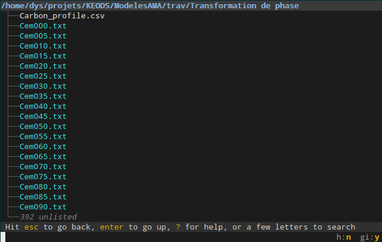
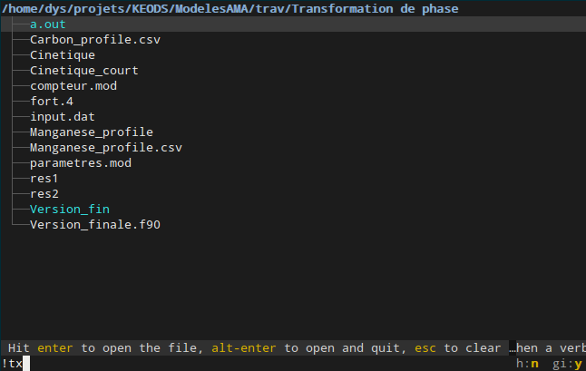
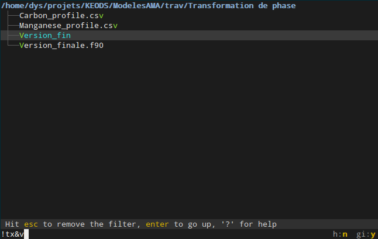
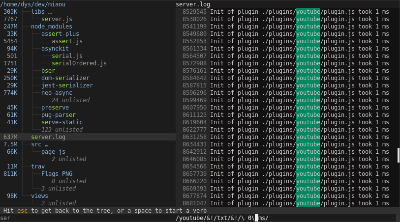

## Replace tree

If you alias `tree` to `br -c :pt`, then


## `dcd` : Deep fuzzy cd

When you want to cd to a deep directory, using `br` is fast and easy enough:

* you type `br` (and `enter`)
* you type the name of the deep folder (or part of it)
* you check the right line is selected
* you do `alt-enter`
* you're done

But when you frequently go to a few specific places, you may prefer a shortcut.

As broot can be driven by commands, you can define this function:

	# deep fuzzy cd
	function dcd {
		br --only-folders --cmd "$1;:cd"
	}

(paste this for example in your .bashrc)

This is the *"I'm feeling lucky"* of broot, you can use it to directly jump to directories you know, when you don't need the interactive search of br.

Example:


## Focus a new directory but keep the current filter

When you hit `enter` on a directory, it's focused and the filter is reset.

If you want to keep the filter, for example to search deeper, you may use `:open_stay_filter` instead (or its shortcut `:osf` and you can bind it to a key shortcut).

## Go to the directory containing the selected file

Suppose you filter to find a file, and it's in a deeper directory, you may want to see it "more closely", that is, keeping the filter, to make its parent directory the current root.

This can be done with the `:focus` verb which can be called with <kbd>ctrl</kbd><kbd>f</kbd>.

## Run a script or program from broot

If your system is normally configured, doing `alt`-`enter` on an executable will close broot and executes the file.

## Change standard file opening

When you hit enter on a file, broot asks the system to open the file. It's usually the best solution as it selects the program according to the file's type following settings you set system wide.

You might still wish to change that, for example when you're on a server without xdg-open or equivalent.

Here's an example of configuration changing the behaviour on open:

```toml
[[verbs]]
invocation = "edit"
key = "enter"
execution = "$EDITOR {file}"
leave_broot = false
apply_to = "file"
```

(the `apply_to` line ensures this verb isn't called when the selected line is a directory)


## Git Status

If you want to start navigating with a view of the files which changed, you may do

    br -ghc :gs

Then just hitting the `esc` key will show you the normal unfiltered broot view.

(note: this isn't equivalent to `git status`. Most notably, removed files aren't displayed)

From there you may use the `:gd` verb (`:git_diff`) to open the selection into your favourite diff viewer.

If you want more: [Use broot and meld to diff before commit](https://dystroy.org/blog/gg/).

## Use negative filters

Here's a (real) example of how negative filters and combination can help you navigate.

Here's the initial view of a directory in which you land:



Type `!txt` to hide unwanted files:



(it's filtered as you type so you stop at `!tx`, it's enough)

Now let's add `&` then some letters of what we want.



We can also select the desired file with arrow keys at this point.

When you grasped the basic logic of [combined filters](../input/#combining-filtering-patterns), navigation is incredibly efficient.


## Use composite searches in preview

You can apply composition and negation to searches in the preview panel which is convenient when filtering, for example, a log file.

In this example I show lines containing "youtube" but not "txt" nor " 0 ms".


